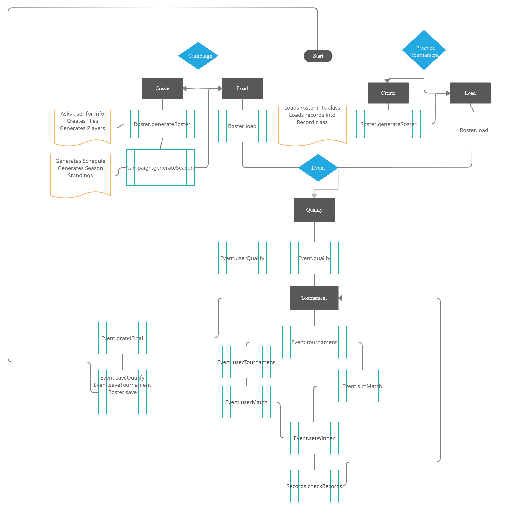

=====================================================
Dev Overview
=====================================================

This project was originally created to be a small game for me to play that wouldn't take me
more than a day to write. As it usually goes, I kept wanting to add one more small feature here and there
and it became this monstrosity. All that said, some of this code is not structured in the best way possible.
I tried to refactor as I went but some sections are a bit too complicated and some classes have become
too bloated with one use helper functions.

Classes
=====================
Roster
------------
This class handles all of the roster functionality. Roster is used to create, load from, and save to the
roster CSV file. Roster also handles loading and saving the Record class

Records
---------------
This class handles all of the records for a save file. This includes:
* Personal Records - A players best time or average
* Event Records - The best time or average set at that event
* All Time Records - The top 100 times and averages ever set in the save file
* Placement Records - Checks if this is the best a player has ever finished in a tournament.
Adds to win count, podium count, etc if applicable.

PracticeTournament
--------------------
Handles menus and calls the appropriate functions in Roster and Event.

Campaign
--------------
Similar to PracticeTournament but with a lot more functionality. Handles things specific to campaigns like:
* New Seasons
* Keeping track of points for the championship
* Campaign Schedules

Player
------------
Holds info about an individual player. When the roster file is loaded each line is put into a
Player object.

Score
----------
This is all just abstract methods handling different things relating to scores and generating
scores during a match.
