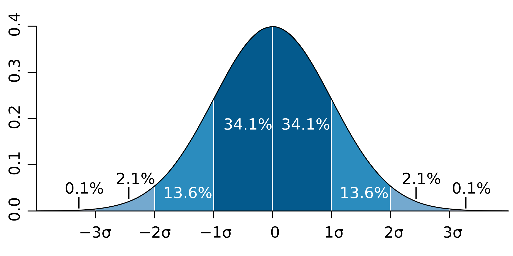

.. _intro-overview:

==========================
Cube Tournament Basics
==========================

This program simulates tournaments where players compete against each other trying to set faster times solving a Rubik's Cube. 
Each match consists of two players completing 5 solves to create an "`average of 5 <https://www.speedsolving.com/wiki/index.php/Average>`_". 
These tournaments use the `double elimination format <https://en.wikipedia.org/wiki/Double-elimination_tournament>`_ where the general idea is that if
you lose twice you are eliminated from the tournament. To qualify for a tournament, each player completes 5 solves and then they are seeded into the tournament based on their average of 5.

Roster Creation
=================================

A roster needs to be generated for either mode. When creating a roster the program will ask you for basic info (name, age, save file name), roster size, and then
ask you how you want to generate the times for each player in the roster. However it is important to understand how a players times are generated:

Individual Player's Times
------------------------------
Each player has two variables, their expected score and their consistency. Times are generated using a `Normal Distribution <https://en.wikipedia.org/wiki/Normal_distribution>`_
Where their expected score is the mean or the midpoint of the curve and the consistency is the standard deviation. In simpler terms the expected score will
determine the average times and the consistency will determine how close or far away from the average each time is.

Custom
-------------------
Choosing custom gives you the ability to set the variables for the roster. There are 4 variables to set:
* Expected score -  This is the mean expected score of all players in the roster.
* Standard Deviation of expected score - This changes how much players expected scores will vary from the mean.
* Consistency - This is the mean consistency of all players in the roster.
* Standard Deviation of Consistency -  This changes how much players consistency scores will vary from the mean.

Auto
-------------------
Choosing Auto will take at least 5 of your most recent times and use that to create a roster around your skill level and consistency.
There are three options to choose from:
* Easy - You will be in the top 0.03% of the roster.
* Medium - You will be in the top 2.2% of the roster.
* Hard - You will be in the top 13% of the roster.

Note: Because standard rosters have 400 players and standard tournaments only have 64 qualify, these numbers are more balanced than they appear.

Game Modes
=================================

Currently you can choose from two different game modes:

Practice Tournament
-------------------------
In this mode you can choose the size of the roster you create, as well as the details of each tournament. After you create your roster, you can use
this roster to run as many tournaments as you want to. In each tournament, you can choose a random number of people that come to the event,
and the number of people that qualify for the tournament. The roster is saved after each tournament and you can see stats on each player as well as records set
in your roster.

Campaign
-------------------
In this mode you battle against a roster of 400 players to gain points over the course of the season to qualify for the world championship tournament.
Each tournament will give you points based on where you place, the points system looks like this:

:1st: 25 
:2nd: 18 
:3rd: 15 
:4th: 12 
:Top 6: 10 
:Top 8: 8 
:Top 12: 6 
:Top 16: 4 
:Top 24: 2 
:Top 32: 1

The first part of the season will consist of "Open" tournaments. These tournaments have the entire roster trying to qualify for the tournament. The second half
of the season will consist of "Invite" tournaments, where only the top players in points for the season are invited to try to qualify for the tournament. Finally, the season ends with the World Championship, where only a select few of the highest scoring players will be seeded into the tournament with no qualification round. The World Championship title goes to the winner of this tournament, regardless of points. The final standings of the season are based on points besides the winner of the World Championship. 

After completing a season, the roster will be updated with new players who just became "old enough" to compete. The roster will also "retire" some players who have reached too old of an age. Current players will also have the chance to improve. Players expected scores and consistency scores will move a small amount, usually for better but sometimes for worse.

Users can play as many seasons as they would like, and records and stats will be kept for the duration.

